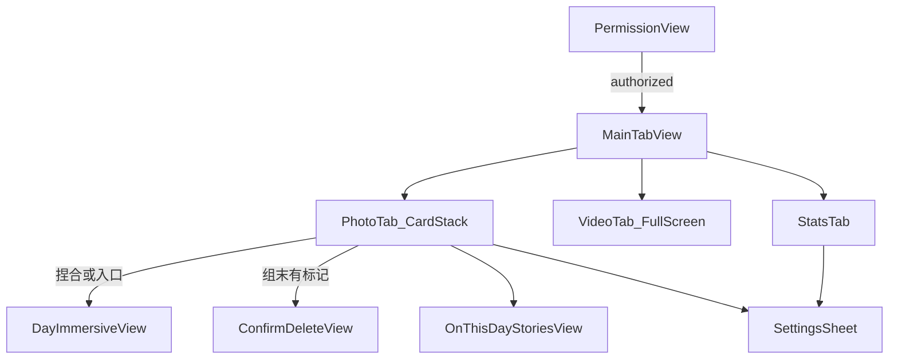

# Linger UI 对齐（去留视觉/结构）Implementation Plan

> **For agentic workers:** REQUIRED SUB-SKILL: Use superpowers:subagent-driven-development (recommended) or superpowers:executing-plans to implement this plan task-by-task. Steps use checkbox (`- [ ]`) syntax for tracking.

**Goal:** 在不做 Pro/付费的前提下，把 Linger 从「单页随机回顾」升级为截图级三 Tab 体验：照片 3D 堆叠（组末确认删除）、视频全屏操作栏（即时删除）、分类型统计与腾出空间，并升级「回到那天」与「那年今日」。

**Architecture:** 根路由改为权限 → `MainTabView`（照片 / 视频 / 统计）。照片与视频使用独立 ViewModel，共享 PhotoKit Services 与 StatsStore。删除语义分叉：照片仍走 `ReviewDeal` + `ConfirmDeleteView`；视频走单条即时 `deleteAssets` + 短时撤销。统计扩展为按 `StatsBucket`（照片/截屏/视频）累计浏览、删除与释放字节。

**Tech Stack:** iOS 17+、SwiftUI、Photos / PhotosUI、AVKit、UserDefaults、XCTest。

## Global Constraints

- 最低 iOS 17；SwiftUI + MVVM + PhotoKit
- **不做** StoreKit / Pro / 付费墙 / 云同步
- **照片 Tab 删除**：上划标记 → 组末 `ConfirmDeleteView` 二次确认后 `deleteAssets`
- **视频 Tab 删除**：右侧垃圾桶即时删除（可短时撤销）；与照片路径分离
- 不展示「还剩 N 张待办」；统计只展示已浏览 / 已删除 / 腾出空间
- 真机验证删除、实况、分享、收藏

## 已锁定产品决策

| 项 | 决策 |
|----|------|
| Pro 横幅 | 不做（统计页无升级入口） |
| 照片删除 | 组末批量确认（保持现语义） |
| 视频删除 | 右侧垃圾桶即时删（可撤销） |
| 分享 / 收藏 | 要做（系统分享 + `PHAssetChangeRequest` 切换 favorite） |
| 底部 Tab | 照片 / 视频 / 统计 |
| 那年今日 | 要做（Stories 分段进度） |
| 回到那天 | 要做（沉浸式改版，替换现 Sheet 网格观感） |

## 目标信息架构



## 文件结构（新增 / 重职责）

```
Linger/
  App/
    RootView.swift              # 权限 → MainTabView
    MainTabView.swift           # 新建：悬浮胶囊 Tab
  Theme/
    LingerTheme.swift           # 新建：色板、玻璃按钮样式
  Components/
    GlassCircleButton.swift     # 新建
    FloatingTabBar.swift        # 新建
    RelativeDateLabel.swift     # 新建：「N 年前」
    SegmentedStorageBar.swift   # 新建：腾出空间分段条
    CardStackView.swift         # 新建：3D 堆叠
  Features/
    PhotoReview/                # 从 Review/ 演进或迁入
      PhotoReviewViewModel.swift
      PhotoReviewView.swift
    VideoReview/                # 新建
      VideoReviewViewModel.swift
      VideoReviewView.swift
    Stats/                      # 新建
      StatsView.swift
      StatsViewModel.swift
    OnThisDay/                  # 新建
      OnThisDayView.swift
      OnThisDayViewModel.swift
    DayTimeline/
      DayImmersiveView.swift    # 新建沉浸 UI；可替换 DayTimelineView
    ConfirmDelete/              # 保留，仅照片路径使用
    Settings/                   # 精简：偏好/权限；成就迁到 Stats
  Domain/Models/
    UserStats.swift             # 扩展分桶 + bytes
    StatsBucket.swift           # 新建：photo / screenshot / video
  Data/
    StatsStore.swift            # 适配新模型 + reset
    AssetByteEstimator.swift    # 新建：删除前估算字节
    PhotoLibraryService.swift   # 增加 favorite / on-this-day fetch
```

---

### Task 1: 统计分桶模型与字节估算

**Files:**
- Create: `Linger/Domain/Models/StatsBucket.swift`
- Modify: `Linger/Domain/Models/UserStats.swift`
- Modify: `Linger/Data/StatsStore.swift`
- Create: `Linger/Data/AssetByteEstimator.swift`
- Test: `LingerTests/UserStatsBucketTests.swift`

**Interfaces:**
- Produces: `enum StatsBucket { case photo, screenshot, video }`
- Produces: `UserStats` 含 `viewedByBucket` / `deletedByBucket` / `freedBytesByBucket`，以及汇总 `viewedCount` / `deletedCount` / `totalFreedBytes`
- Produces: `StatsStore.recordViewed(bucket:)` / `recordDeleted(bucket:bytes:)` / `resetAll()`
- Produces: `AssetByteEstimator.estimatedBytes(forLocalIdentifier:) async -> Int64`

- [ ] **Step 1: 写失败单测（分桶累加与 reset）**

```swift
func testRecordByBucketAndReset() {
    var stats = UserStats.empty
    stats.recordViewed(bucket: .photo, count: 2)
    stats.recordDeleted(bucket: .video, count: 1, freedBytes: 1_024)
    XCTAssertEqual(stats.viewedCount, 2)
    XCTAssertEqual(stats.deletedByBucket[.video], 1)
    XCTAssertEqual(stats.totalFreedBytes, 1_024)
    stats.reset()
    XCTAssertEqual(stats, .empty)
}
```

- [ ] **Step 2: 运行测试确认失败**

Run: `xcodebuild -scheme Linger -destination 'platform=iOS Simulator,name=iPhone 16,OS=18.4' -only-testing:LingerTests/UserStatsBucketTests test`

- [ ] **Step 3: 实现 `StatsBucket` + 扩展 `UserStats`（Codable 兼容旧键：旧 `viewedCount`/`deletedCount` 迁移进 `.photo`）**

- [ ] **Step 4: 实现 `AssetByteEstimator`（`PHAssetResource` 累加 `value(forKey: "fileSize")` 或 `assetResources` 文件大小；失败返回 0）**

- [ ] **Step 5: `StatsStore` 增加 `resetAll()`（清统计；调用方同时清 `RecentViewedStore`）**

- [ ] **Step 6: 测试通过后提交**

```bash
git add Linger/Domain/Models Linger/Data LingerTests/UserStatsBucketTests.swift
git commit -m "feat: bucketed stats and freed-bytes estimator"
```

---

### Task 2: 主题组件 + 悬浮 Tab 壳

**Files:**
- Create: `Linger/Theme/LingerTheme.swift`
- Create: `Linger/Components/GlassCircleButton.swift`
- Create: `Linger/Components/FloatingTabBar.swift`
- Create: `Linger/App/MainTabView.swift`
- Modify: `Linger/App/RootView.swift`

**Interfaces:**
- Produces: `enum MainTab: Hashable { case photos, videos, stats }`
- Produces: `MainTabView` 承载三页占位 + `FloatingTabBar`
- Produces: `GlassCircleButton(systemName:action:)`

- [ ] **Step 1: 定义暗色色板（避免默认紫主题；照片舞台近黑，回到那天可用深紫渐变局部）**

```swift
enum LingerTheme {
    static let canvasTop = Color(red: 0.07, green: 0.08, blue: 0.10)
    static let canvasBottom = Color(red: 0.02, green: 0.02, blue: 0.04)
    static let glassFill = Color.white.opacity(0.12)
    static let accentBlue = Color(red: 0.25, green: 0.48, blue: 1.0)
    static let accentRed = Color(red: 1.0, green: 0.35, blue: 0.38)
    static let accentGreen = Color(red: 0.45, green: 0.85, blue: 0.35)
}
```

- [ ] **Step 2: 实现 `FloatingTabBar`（三 Tab 中文：照片 / 视频 / 统计；选中浅底高亮）**

- [ ] **Step 3: `RootView` 在 `.review` 时进入 `MainTabView`；照片/视频/统计先挂现有 `ReviewContainerView` / 占位 / 简易 Stats**

- [ ] **Step 4: 模拟器目视：权限通过后底部胶囊可切换**

- [ ] **Step 5: Commit**

```bash
git commit -m "feat: floating tab shell and glass theme primitives"
```

---

### Task 3: 照片 Tab — 3D 卡片堆 + 组末确认

**Files:**
- Create: `Linger/Components/CardStackView.swift`
- Create: `Linger/Features/PhotoReview/PhotoReviewView.swift`
- Create: `Linger/Features/PhotoReview/PhotoReviewViewModel.swift`（可由 `ReviewViewModel` 重命名/迁入）
- Modify: `Linger/Features/ConfirmDelete/ConfirmDeleteView.swift`（仅照片路径引用）
- Modify: `Linger/App/MainTabView.swift`

**Interfaces:**
- Consumes: 现有 `fetchRandomItems`、`ReviewDeal`、`ConfirmDeleteView`、`skipUnavailableCurrent`
- Produces: 上划标记删除、左滑保留、捏合 → 回到那天；组末 `phase == .confirming` 推确认页
- Produces: 左上角筛选胶囊（类型子集；数量显示本组剩余或本组 size）

**删除语义（强制）：**
- 上划 = `markDeleteCurrent()`，**不**立即 `deleteAssets`
- 组末有标记 → `ConfirmDeleteView`；用户确认后才删除

- [ ] **Step 1: `CardStackView`：展示当前卡 + 后 2 张预览，`rotation3DEffect` + offset；拖拽绑定 `dragOffset`**

- [ ] **Step 2: 把现有 Review 手势/确认流迁到 `PhotoReviewViewModel`；统计改为 `recordViewed(bucket:)`（用 `MediaKind` → `StatsBucket` 映射：screenshot→screenshot，video→video，其余→photo）**

- [ ] **Step 3: 左上角 `Menu`：「照片」筛选非视频类型；保留设置入口（齿轮可放照片页或统计页）**

- [ ] **Step 4: `MainTabView` 照片 Tab 接 `PhotoReviewView`**

- [ ] **Step 5: 单测：标记删除不调用 `deleteAssets`（Mock 计数为 0）；确认后才调用**

- [ ] **Step 6: Commit**

```bash
git commit -m "feat: photo tab 3D stack with end-of-deal confirm delete"
```

---

### Task 4: 视频 Tab — 全屏 + 右侧操作栏（即时删除）

**Files:**
- Create: `Linger/Features/VideoReview/VideoReviewViewModel.swift`
- Create: `Linger/Features/VideoReview/VideoReviewView.swift`
- Create: `Linger/Components/RelativeDateLabel.swift`
- Modify: `Linger/Domain/Protocols/PhotoLibraryServing.swift`（`setFavorite`）
- Modify: `Linger/Data/PhotoLibraryService.swift`
- Modify: `Linger/Components/VideoPreviewView.swift`（进度回调）
- Test: `LingerTests/VideoReviewViewModelTests.swift`

**Interfaces:**
- Produces: `VideoReviewViewModel`：`loadNext()` 仅 `allowedKinds: [.video]`；`toggleFavorite()`；`sharePayload()`；`deleteCurrent()` 即时删；`undoDelete()` 短时窗口（若系统已删则撤销仅能提示无法恢复——**即时删成功后撤销改为「撤回标记」不适用**；采用：**先标记本地隐藏并启动 5s 撤销窗，窗内可 `undo` 取消删除；超时或下一条后才真正 `deleteAssets`**）
- **撤销策略（锁定）：** 点垃圾桶 → 当前条滑走并进入「待删队列」+ Toast「撤销」；5 秒内撤销则恢复队列；超时或切下一条时批量/单条 `deleteAssets`（与照片组末不同，无独立确认页）

- [ ] **Step 1: 协议增加**

```swift
func setFavorite(_ favorite: Bool, id: String) async throws
```

- [ ] **Step 2: `VideoReviewViewModelTests`：点删后 5s 内 undo 不调用 delete；超时后调用 delete 一次**

- [ ] **Step 3: UI：全屏播放、右侧 Heart / Share / Trash / Undo、底部细进度条、左下「N 年前」**

- [ ] **Step 4: 分享用 `ShareLink` 或临时导出文件 URL（`PHAssetResourceManager`）；失败 Toast**

- [ ] **Step 5: 删除成功后 `recordDeleted(bucket: .video, freedBytes:)`**

- [ ] **Step 6: Commit**

```bash
git commit -m "feat: video tab fullscreen review with deferred instant delete"
```

---

### Task 5: 统计 Tab（无 Pro）

**Files:**
- Create: `Linger/Features/Stats/StatsView.swift`
- Create: `Linger/Components/SegmentedStorageBar.swift`
- Modify: `Linger/Features/Settings/SettingsView.swift`（成就区可改为跳转说明或删除重复）
- Modify: `Linger/Data/RecentViewedStore.swift`（暴露 `reset()` / `clear()`）

**Interfaces:**
- 展示三块：照片 / 截屏 / 视频 — 查看、删除、清理字节
- 「腾出空间」总字节 + `SegmentedStorageBar`（三色占比）
- 「重置浏览记录」：确认 Alert → `statsStore.resetAll()` + `recentStore.clear()`
- **无**「升级到 Pro」模块

- [ ] **Step 1: 实现 `StatsView` 列表/卡片布局（暗色卡片，对齐截图信息结构）**

- [ ] **Step 2: `SegmentedStorageBar(fractions:)` 按 `freedBytesByBucket` 归一化；全 0 时显示空条**

- [ ] **Step 3: 重置流程带破坏性确认文案**

- [ ] **Step 4: 照片 Tab 齿轮可打开原 `SettingsView`（每组数量、权限、类型细分）**

- [ ] **Step 5: Commit**

```bash
git commit -m "feat: stats tab with per-bucket metrics and reset"
```

---

### Task 6: 回到那天（沉浸改版）

**Files:**
- Create: `Linger/Features/DayTimeline/DayImmersiveView.swift`
- Modify: `Linger/Features/PhotoReview/PhotoReviewView.swift`（捏合 present 新页）
- Keep or thin: `DayTimelineView.swift`

**Interfaces:**
- 全屏紫黑渐变；顶栏返回 /「回到那天」+ `yyyy/M/d` / 完成
- 横向 snap 大圆角卡片（`ScrollView(.horizontal)` + `scrollTargetBehavior`）
- 底栏：刷新当日、关闭/撤销入口
- 数据：现有 `fetchItems(on:allowedKinds:)`

- [ ] **Step 1: 实现 `DayImmersiveView(day:photoLibrary:allowedKinds:)`**

- [ ] **Step 2: 照片 Tab 捏合与入口改为 present `DayImmersiveView`（全屏 cover）**

- [ ] **Step 3: 空日 / 错误态保留**

- [ ] **Step 4: Commit**

```bash
git commit -m "feat: immersive back-to-that-day browser"
```

---

### Task 7: 那年今日（Stories）

**Files:**
- Create: `Linger/Features/OnThisDay/OnThisDayViewModel.swift`
- Create: `Linger/Features/OnThisDay/OnThisDayView.swift`
- Modify: `Linger/Domain/Protocols/PhotoLibraryServing.swift`
- Modify: `Linger/Data/PhotoLibraryService.swift`
- Modify: Mock + tests

**Interfaces:**
- Produces: `fetchOnThisDayItems(allowedKinds:) async throws -> [MediaItem]`  
  谓词：每年的「今天」月日（`Calendar` 枚举近年或用 `creationDate` 的 month/day 匹配；实现选用：取最近 N 年同月日区间 merge）
- UI：顶部分段进度、实况徽章、底栏收藏 / 「N 年前」+ info / 回放
- 入口：照片 Tab 合适位置（如筛选 Menu 内「那年今日」或空态/节日入口按钮）

- [ ] **Step 1: Mock 单测：同月日跨年命中、非同月日排除**

- [ ] **Step 2: PhotoKit 实现 + Stories UI（手动点左右或计时前进）**

- [ ] **Step 3: Commit**

```bash
git commit -m "feat: on-this-day stories browser"
```

---

### Task 8: 打磨、文档、回归

**Files:**
- Modify: `README.md`
- Modify: `docs/superpowers/specs/2026-07-23-linger-design.md`（同步：三 Tab、视频即时删、无 Pro、分桶统计）
- Modify: `docs/superpowers/plans/2026-07-23-linger-implementation.md`（勾选 Phase 7）

- [ ] **Step 1: 更新规格「目标/非目标/手势/统计」与本计划一致**

- [ ] **Step 2: README 手势与 Tab 说明；明确照片组末确认 vs 视频延迟即时删**

- [ ] **Step 3: 全量 `xcodebuild test`；真机冒烟：照片确认删、视频撤销窗、分享、收藏、统计重置**

- [ ] **Step 4: Commit**

```bash
git commit -m "docs: sync Linger UI parity decisions and usage"
```

---

## 删除语义对照（防实现时混用）

| | 照片 Tab | 视频 Tab |
|--|----------|----------|
| 触发 | 上划标记 | 右侧垃圾桶 |
| 确认页 | 有（组末） | 无 |
| 撤销 | 标记后短时撤销 | 真正删除前 5s Toast 撤销 |
| `deleteAssets` 时机 | 确认页提交 | 撤销窗结束 / 切下一条时 flush |

## 明确不做

- Pro / StoreKit / 付费墙文案与入口
- 云同步、社交 feed、AI 整理
- Android

## 风险与注意

- 视频「撤销」必须在 **系统删除前**；一旦 `deleteAssets` 成功无法恢复文件
- 3D 堆叠性能：只渲染顶卡高清 + 后 2 张缩略
- 字节估算在 iCloud 未下载资源上可能为 0——UI 显示「0 字节」可接受
- `UserStats` 迁移需兼容已安装用户的旧 UserDefaults
